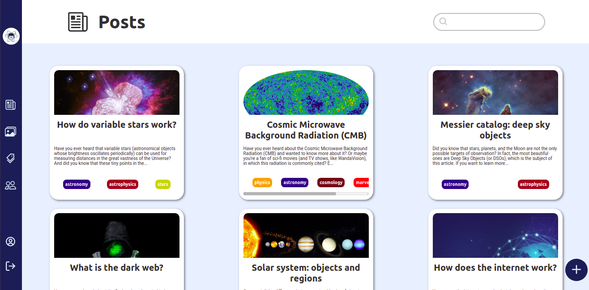

# STEM Guy

The STEM Guy club is a blog about science and technology.

This is the administration system of it, which is available at [admin.stemguy.club](https://admin.stemguy.club) (authentication required).
> Accessible demo to be created

## Features

- CRUD of posts
- CRUD of images
- CRUD of flags
- CRUD of members

## Technologies

- [JavaScript](https://www.javascript.com)
- [TypeScript](https://www.typescriptlang.org)
- [React.js](https://reactjs.org)
- [Next.js](https://nextjs.org)
- [Styled Components](https://styled-components.com)
- [SweetAlert2](https://sweetalert2.github.io)
	> Popup boxes
- [SWR](https://swr.vercel.app)
	> React Hooks library for data fetching

## Associated repositories

- [stemguy](https://github.com/iago-mendes/stemguy)
	> Main website
- [stemguy-server](https://github.com/iago-mendes/stemguy-server)
	> API
- [stemguy-links](https://github.com/iago-mendes/stemguy-links)
	> Landing page with links
- [stemguy-posts](https://github.com/iago-mendes/stemguy-posts)
	> Articles in Markdown